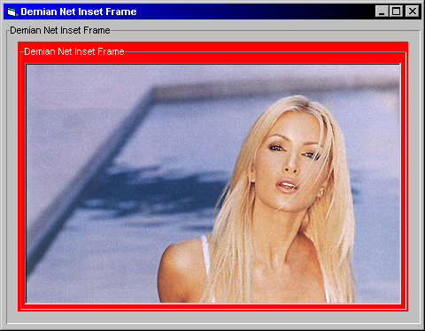



## Inset Frame Control

### Description

I always hated the way that the normal Visual Basic frame looked, it was so ugly so I made this one. It does pretty much everything that the normal frame does just with a different look. please vote & tell me what you think :)

P.S. Feel free to add on to this code & upload, id love to see what could be done with it.
 
### More Info
 

             |
---                |---
**Submitted On**   |2000-10-02 16:00:18
**By**             |[Max Demian](https://github.com/Planet-Source-Code/PSCIndex/blob/master/ByAuthor/max-demian.md)
**Level**          |Advanced
**User Rating**    |3.4 (17 globes from 5 users)
**Compatibility**  |VB 5\.0, VB 6\.0
**Category**       |[OLE/ COM/ DCOM/ Active\-X](https://github.com/Planet-Source-Code/PSCIndex/blob/master/ByCategory/ole-com-dcom-active-x__1-29.md)
**World**          |[Visual Basic](https://github.com/Planet-Source-Code/PSCIndex/blob/master/ByWorld/visual-basic.md)
**Archive File**   |[CODE\_UPLOAD103831022000\.zip](https://github.com/Planet-Source-Code/max-demian-inset-frame-control__1-11857/archive/master.zip)

